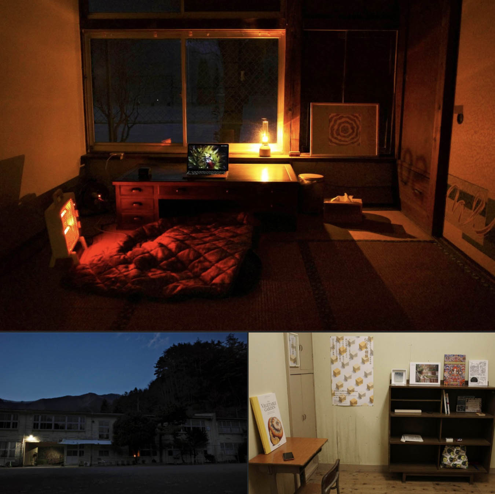

# Code for Okutama

```
#コードフォー奥多摩 #コードフォーオクタマ #コード・フォー・オクタマ #CodeForOkutama #CFO
```

- [お問い合わせ:ContactForm](https://docs.google.com/forms/d/e/1FAIpQLSc6VYzbGQHDt16gFmeK7rctmjfijtZQaCXdK36yW_CfN9T66w/viewform?usp=sf_link)

## 概要
Code for Okutamaは奥多摩エリア在住の情報通信技術者を中心としたデジタル・クリエーターのコミュニティです。
旧小河内小を拠点に奥多摩エリアでの文化振興を目的にして活動します。

### 基本情報
- 設立：２０２２年１月１日
- 住所：東京都西多摩郡奥多摩町留浦１２３７


設立時の執務室の様子（2022年1月）

## プロジェクト

### 計画中
- 個人の既存プロジェクトをCode for Okutamaに移管する（計算検定問題の自動生成システム, 日本語学習ソフト）
- ロゴおよび名刺の作成

### 実施中
- 町内でのプログラミング教室の実施

### 完了
- [Global Game Jam 2022（奥多摩会場）のイベント企画・運営](./projects/ggj2022.md)
